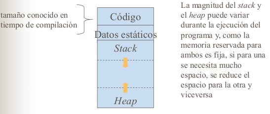

#### Gestión y reserva de memoria

##### 1. Administración de la memoria en tiempo de ejecución
Al ejecutar un programa, la memoria se divide (de manera lógica), en:   
- Código ejecutable: Código máquina, constantes y literales, las cuales
ocupan espacio fijo en memoria y están situadas en una zona estática de la
memoria   
- Datos: Variables globales y estáticas  
- La pila o *stack* de control: Variables locales y resultados intermedios  
- Monticulo o heap: Guarda el resto de la información generada en tiempo de
ejecución y bloques de memoria direccionados por los punteros.  

##### 2. Registros de activación  

Sitios donde se van a guardar todo lo relacionado del programa, como pueden ser
los valores devueltos, parametros actuales, enlaces, etc.

##### 3. Estrategias de asignación de memoria
- Asignación estática. Dispone la memoria para todos los datos durante la
compilación
- Asignación por medio de una pila: Trata la memoria de ejecución como una pila
- Asignación por medio de montículo y desasigna la memoria conforme se necesita,
durante la ejecución

##### 4. Asignación de estática de memoria  

- El tamaño de toda memoria que va a ser reservada es conocido en tiempo de
compilación
- Los objetos están vigentes desde que comienza la ejecución del programa hasta
que termina
- La memoria se reserva de manera consecutiva
- La dirección de memoria de los objetos se puede conocer en tiempo de compilación

Esto puede tener las siguientes ventajas e inconvenientes
- Ventajas:
     - La implementación de esta estrategia es simple
     - Conocer las direcciones de las variables al generar el código objeto,
     mejora el tiempo de ejecución de los programas.
     - Se suele utilizar en asignaciones estáticas para datos globales
- inconvenientes:
     - El tamaño del objeto ha de ser conocido en tiempo de compilación
     - Si no se asigna memoria en tiempo de ejecución:
          - No permite procedimientos recursivos puesto que las llamadas recursivas
          utilizarían las mismas posiciones de memoria.
          - Las estructuras de datos no se pueden crear dinamicamente (lista, arboles)

##### 5. Asignación mediante pila (*stack*)
##### 6. Asignación mediante montículo
##### 7. El arbol de activación
