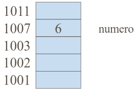
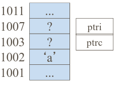

# Punteros

Cuando declaramos una variable, asociamos 3 atributos con la misma

- Nombre
- Tipo
- Dirección en memoria

Por ejemplo para la declración de ```int numero=6;```. Quedaría de la siguiente
manera



## 1. Tipo de dato puntero

No es mas que un tipo de dato que contiene la dirección de memoria de un dato

Se declara de la siguiente manera:

``` Tipo de variable * Nombre de la variable ```

Siendo el tipo cualquiera predefinido o creado. En su declaración se reserva
memoria para albergar la dirección de memoria de un dato, no el dato en si.

Alguno ejemplos de declaraciónes son los siguientes:

```   

char c = 'a';
char * ptrc;
int * ptri;

```
Siendo su representación gráfica esta:



Se declara

- ```c```  como una variable de tipo caracter cuyo valor es 'a'  
- ```ptri``` como una variable de tipo puntero que puede contener direcciones
de memoria de objetos de tipo ```int```   
- ```ptrc``` como una variable puntero que puede contener direcciones de memoria
de objetos de tipo char  

## 2. Punteros y verificación de tipos  

- Los punteros se enlazan a tipos de datos especificos, de modo que C verificará
si se asigna la dirección de un tipo de dato al tipo correcto de puntero.  
- Así, por ejemplo, si se define un puntero a ```float```, no se le puede asignar
la dirección de un caracter o un entero. Un ejemplo:

```
float * pf;
char c;
pf = &c; // Dará error
```

· El tamaño de memoria reservado para albergar un puntero es el mismo
(normalmente 32 bits) independientemente del tipo de dato al que apunte (todos
almacenan una dirección de memoria)  

## 3. Operadores

### Operadores de dirección: &<variable>

- Devuelve la dirección de memoria donde empieza la variable <variable>
- Se utiliza habitualmente para asignar valores a datos de tipo puntero. Como por ejemplo: int i, *ptri; ptri = &i;
    + i es una variable de tipo entero, por lo que la expresión &i es la dirección de memoria
    + Se dice que ```ptri``` apunta o referencia a ```i```

### Operadores de contenido: *<puntero>
- Devuelve el contenido del objeto referenciado por ```<puntero>```
- Esta operación se usa para acceder al objeto referenciado o apuntado por el puntero. Por ejemplo char c, *ptrc; ptrc = &c; *ptrc='A' (equivale a c = 'A')
    + ptrc es un puntero a caracter que contiene la dirección de C, por tanto, la expresión *ptrc es el objeto apuntado por el puntero, es decir, c.

## 4. Representación de punteros

Utilizamos ```print``` para representarlos pero tenemos los siguientes tipos
    - %lu: vista como un entero largo
    - %X: vista en hexadecimal mayusculas
    - %p: vista en hexadecimal en minúsculas
    - %x: vista en hexadecimal en minúsculas

## 5. Punteros NULL y void

- NULL
    + Puntero nulo. No apunta a ninguna parte en particular, no direcciona ningún dato válido en memoria
    + Proporciona un medio de conocer cuando una variable puntero no direcciona a un dato válido
    + Definida en stddef.h, stdio.h, stdlib.h y string.h.
    + Tambien se puede definir


## *Trabajando con punteros en funciones ... paso de parametros por referencia y por valor

     - Protoipos lo declaramos con *
     - En el main lo declaramos con el tipo que le corresponda a la variable
          - En la llamada dentro del main ponemos referencia (&)

               - Tambien se puede dar el caso de que en el main declaremos el puntero
               - En este caso en la llamada a la funcion iría sin &

     - Definicion de la función lo ponemos con *
          - dentro de la funcion trabajamos con la variable de manera normal

Ejemplo practico


     Prototipo

          void minimo_referencia(int num1,int num2,int *min);

     Main

          Declaración
               int min

          Llamada
               minimo_referencia(a, b, &min);

     Definicion de la funcion

          void minimo_referencia(int num1,int num2,int *min)
